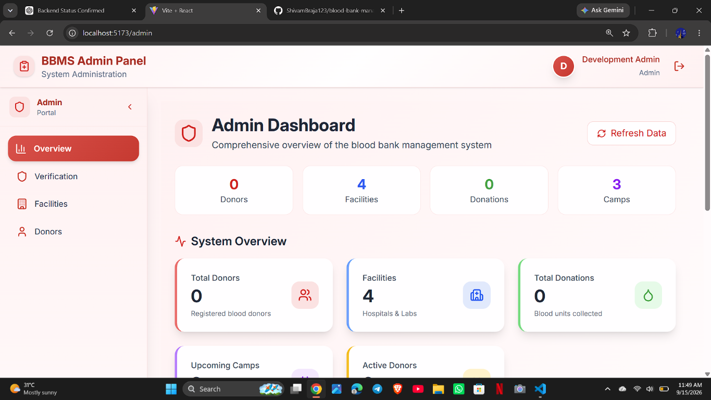
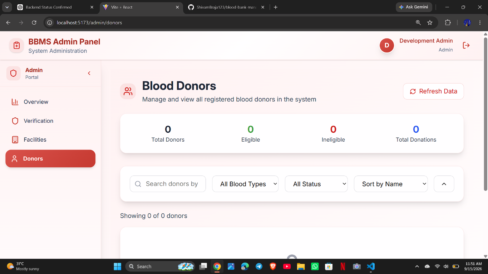

# Blood Bank Management System

A full-stack blood bank management application for coordinating donors, hospitals, blood laboratories, inventory, blood requests, and administrative approvals through a role-based web interface.

## Key Features

- Donor registration, profile management, eligibility information, camps, and donation history
- Hospital registration, approval workflow, inventory, donor directory, and blood requests
- Blood-lab registration, approval workflow, blood stock, donation camps, donor search, and request management
- Admin dashboard with facility approval, facility management, donor management, and system statistics
- Blood stock transfer from an approved blood lab to an approved hospital
- JWT-based authentication with protected API routes and role-based authorization
- MongoDB persistence through Mongoose
- Swagger/OpenAPI documentation endpoint

## User Roles

### Donor

Donors can register, sign in, manage their profile, review eligibility and donation history, and view blood donation camps.

### Hospital

Hospitals register for approval, then manage their profile and inventory, browse donors, view approved blood labs, and submit blood requests.

### Blood Lab

Blood labs register for approval, then manage blood stock and camps, search donors, record donations, and accept or reject hospital blood requests.

### Admin

Admins authenticate through the same login flow and can view system statistics, inspect facilities and donors, and approve or reject hospital and blood-lab registrations.

## Main Workflow

1. A donor registers directly.
2. A hospital or blood lab registers with a pending status.
3. An admin reviews and approves or rejects the facility.
4. Approved blood labs add and manage blood inventory.
5. Approved hospitals select an approved blood lab and submit a blood request.
6. The blood lab reviews the request and accepts or rejects it.
7. When accepted, available blood stock is transferred from the lab to the hospital.
8. Authorized users can view blood availability and use role-specific donor and inventory features.

## Authentication and Authorization

- JWTs are issued by the backend after successful login.
- The frontend stores the token locally for authenticated sessions.
- Protected requests send the token in the `Authorization: Bearer <token>` header.
- Backend middleware validates JWTs and loads the authenticated user or facility.
- Admin, hospital, blood-lab, and donor routes enforce the appropriate role or facility type.
- Facility accounts remain unavailable for login until an admin approves them.

## Technology Stack

### Frontend

- React
- Vite
- React Router
- Axios and Fetch API
- Tailwind CSS
- Framer Motion
- Lucide React
- React Hot Toast and React Toastify

### Backend

- Node.js
- Express
- MongoDB and Mongoose
- JSON Web Tokens (`jsonwebtoken`)
- `bcryptjs` password hashing
- CORS
- Swagger UI and `swagger-jsdoc`

## Project Structure

```text
.
├── backend/
│   ├── controllers/       # Request and business logic
│   ├── middleware/        # Shared authentication middleware
│   ├── middlewares/       # Role and resource-specific middleware
│   ├── models/            # Mongoose models
│   ├── routes/            # Express API routes
│   ├── openapi/           # Swagger/OpenAPI configuration
│   ├── scripts/           # Development setup scripts
│   └── server.js          # Express server entry point
├── frontend/
│   ├── public/             # Public frontend assets
│   └── src/
│       ├── components/     # Shared UI and layout components
│       ├── pages/          # Role-specific and public pages
│       └── utils/          # Frontend authentication helpers
├── docs/
│   └── images/             # Repository-local project screenshots
├── docker-compose.yml
└── README.md
```

## Screenshots

The following screenshots are from this project:

### Admin Dashboard



### Admin Donor Management



## Local Setup

### Prerequisites

- Node.js and npm
- MongoDB or a MongoDB Atlas cluster

### Clone the Repository

```bash
git clone https://github.com/ShivamBraja123/blood-bank-management-system.git
cd blood-bank-management-system
```

### Backend Environment

Create `backend/.env` using the existing `backend/.env.example` as a reference:

```env
MONGO_URI=your_mongodb_connection_string
JWT_SECRET=your_long_random_jwt_secret
PORT=5000
```

Do not commit `.env` files or real credentials.

### Install Dependencies

```bash
cd backend
npm install

cd ../frontend
npm install
```

The frontend reads the backend base URL from `frontend/.env`:

```env
VITE_API_URL=http://localhost:5000
```

## Development Admin Setup

The backend includes a development-only admin seed command:

```bash
cd backend
$env:DEV_ADMIN_EMAIL="admin@example.local"
$env:DEV_ADMIN_PASSWORD="use-a-local-development-password"
npm run seed:admin
```

On macOS/Linux, set the variables with:

```bash
DEV_ADMIN_EMAIL=admin@example.local \
DEV_ADMIN_PASSWORD=use-a-local-development-password \
npm run seed:admin
```

The seed command requires `MONGO_URI`, creates the admin only if the configured email does not already exist, and refuses to run when `NODE_ENV=production`.

## Run the Application

Start the backend:

```bash
cd backend
npm start
```

The backend runs on `http://localhost:5000` by default.

In a second terminal, start the frontend:

```bash
cd frontend
npm run dev
```

The Vite development server runs on `http://localhost:5173` by default.

## API and Backend Overview

The Express server mounts the following route groups:

| Route group | Purpose |
| --- | --- |
| `/api/auth` | Registration, login, and authenticated profile |
| `/api/donor` | Donor profile, statistics, camps, and history |
| `/api/facility` | Facility profile, dashboard, and approved-lab lookup |
| `/api/hospital` | Hospital inventory, donor access, and blood requests |
| `/api/blood-lab` | Lab dashboard, camps, blood stock, donor search, and request processing |
| `/api/admin` | Admin dashboard, facility approval, facility listing, and donor management |
| `/api/doc` | Swagger UI and generated API documentation |

Protected endpoints require a valid bearer token. Hospital and blood-lab operations additionally require an approved facility with the matching facility type.

## Database

The application uses MongoDB through Mongoose. It supports a local MongoDB instance or MongoDB Atlas by setting `MONGO_URI` in `backend/.env`. Database credentials and connection strings must remain local and must never be committed.

## Security Notes

- Keep `backend/.env` and all environment-specific files out of version control.
- Use a strong, unique `JWT_SECRET` outside local development.
- Use a strong local-only password when running the development admin seed.
- Do not expose MongoDB credentials, JWT secrets, or API keys in source code.
- Keep facility approval and role-based authorization enabled.
- Use HTTPS and secure deployment secrets in production.
- Review and rotate development credentials before sharing a deployed environment.

## Future Improvements

- Add automated backend and frontend test coverage.
- Add pagination and filtering improvements for larger datasets.
- Add audit logging and more detailed admin reporting.
- Add production deployment documentation and managed secret configuration.
- Improve transactional handling for stock transfers and concurrent requests.

## License

This project is distributed under the MIT License. See [LICENSE](LICENSE) for details.
